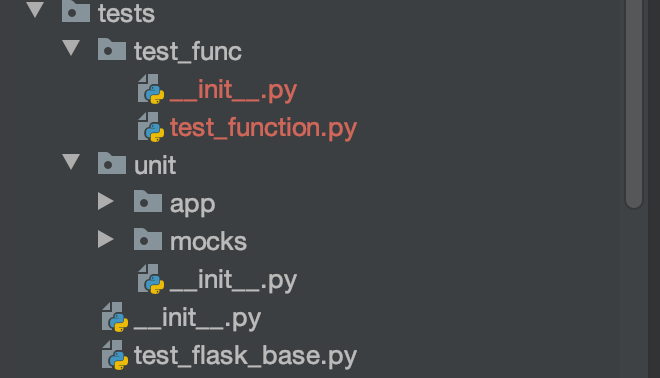
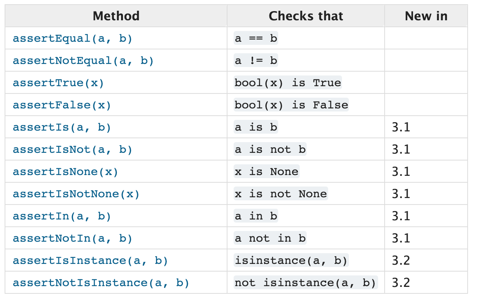
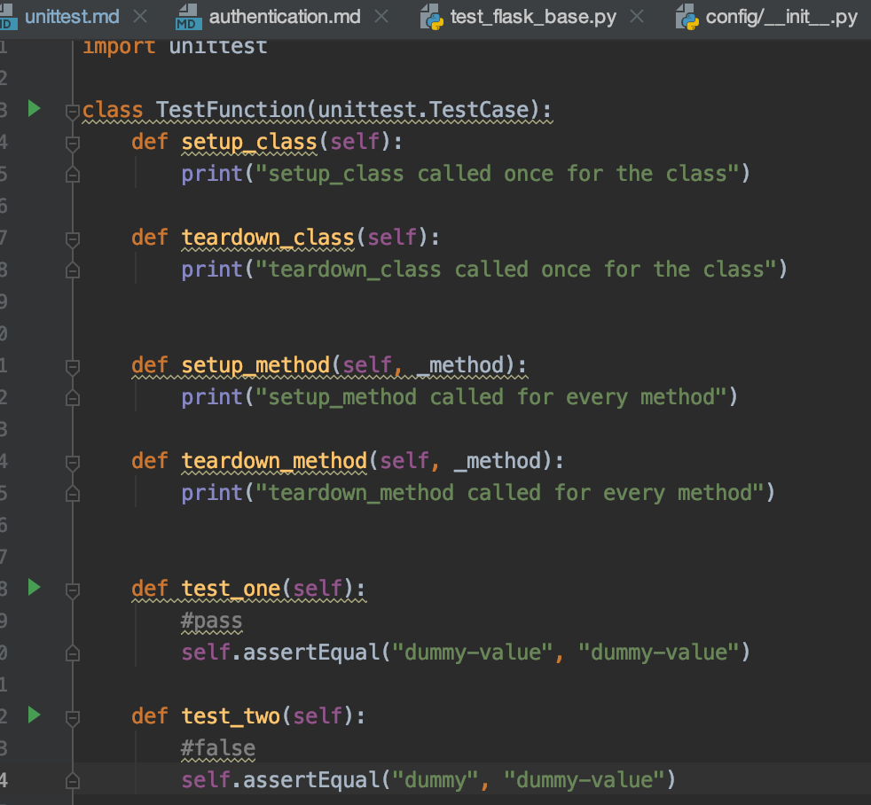
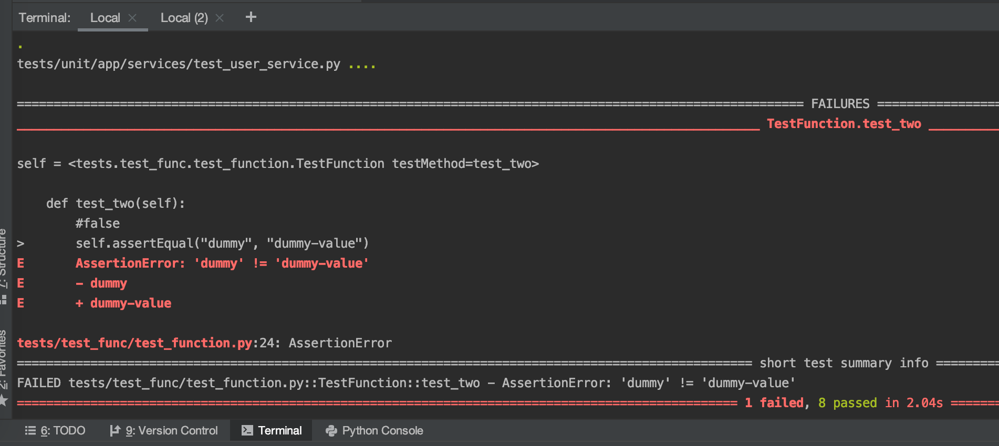

# Unit Testing

Something that is untested is broken. Writing and running Unit Tests are important to check that every module works correctly, and according to requirements

## How to run Unit Tests

For Local Python Environment: Run the Unit Test modules

``` bash
poetry run python manage.py test
```

For Docker-Compose:

1. First run the Test Container

    ``` bash
    docker-compose -f docker-compose.test.yml up -d
    ```

    Alternatively, you can run `make test` in the terminal.

2. Run the Unit Test modules

    ``` bash
    docker-compose exec app poetry run python manage.py test
    ```

    Alternatively, you can run `make run-test` in the terminal.

## About Unit Tests

Flask provides a way to test your application by exposing the Werkzeug test Client and handling the context locals for you. You can then use that with your favourite testing solution. Flask App Base makes use of Pytest module to conduct testing.

### About Pytest Module

The [Pytest](https://docs.pytest.org/en/latest/index.html) framework makes it easy to write small tests, yet scales to support complex functional testing for applications and libraries.

``` python
# test_function.py
def foo(x):
    return x + 1

def test_foo():
    assert inc(3) == 5
```

### Conventions for Python test discovery

Pytest implements test discovery. Collection starts from `/app/tests` directory.

For example, you can find service unittest under
`app-dir/tests/unit/app/services/`



In those directories, search for `test_*.py or *_test.py` files

### About Faker Module

[Faker](https://faker.readthedocs.io/en/stable/) is a Python package that generates fake data for you.
Whether you need to bootstrap your database, create good-looking XML documents,
fill-in your persistence to stress test it, or anonymize data taken from a production service, Faker is for you.

Use:

`pip install Faker`

```python
from faker import Faker
fake = Faker()

fake.name()
# 'Lucy Cechtelar'
```

## Writing Unit Tests

### Writing Service and Repository layers for Unit Tests

Unit Testing will often require its own service and repository layers to conduct the individual tests. This is to ensure that all components of the app runs as expected.

#### Implement Service Layer

```python
class TestStorageService:
    def setup_method(self, _method):
        pass

    def teardown_method(self, _method):
        pass

    def test_upload(self):
        service = self._get_service()

        path = os.getcwd()
        fileTmp = open(path+"/tests/unit/mocks/test_data/image.jpg", "rb")

        file = FileStorage(fileTmp)
        fileObject = service.upload(file)
        assert fileObject.url is not None


    @staticmethod
    def _get_service():
        return StorageService(MockStorageRepository(None), Local(), S3())
```

#### Implement Repository Layer

If Service Layer requires Repository, you should create Mock Repository. The mock repository should be under: `app-dir/tests/unit/mocks/repositories/`

```python
from faker import Faker

from app.models import File
from app.repositories import FileRepository

class MockStorageRepository(FileRepository):
    model_class = File

    def get_model(self) -> File:
        fake = Faker()
        params: Dict = {
            "id": fake.pyint(),
            "url": fake.url(),
            "storage_type": 'local',
            "media_type": 'image',
        }
        return self.model_class(**params)

    def all(self) -> List[File]:
        # return all objects

    def get(self, offset: int, limit: int, order: Any = None) -> List[File]:
        # return queried object

    # Implement other create, update, delete, find, exist functions here
```

## `Setup` and `Teardown` methods?

the `setup` method is called prior to each unit test executing and the `teardown` method is called after each unit test finishes executing.

You can use setup and teardown in the complex test case.

## Using the TestCase class to check for and report failures

Implementing the TestCase class:

```python
import unittest

class TestFunction(unittest.TestCase):
    #code here
```

### Assertion Methods

Use these Assertion Methods to ensure your code provides the right output.

#### All Assertion Methods



#### Example of usage



#### Assertion failure is raised when the actual output does not match the expected output.

